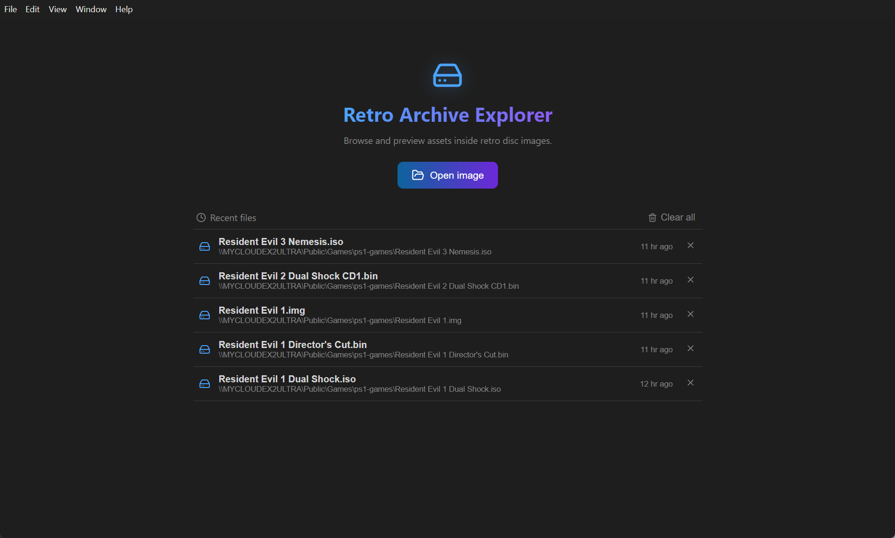

<p align="center">
  
</p>

<h1 align="center">Retro Archive Explorer</h1>

<p align="center">Browse and preview the assets packed inside retro (PlayStation-era) disc images — right down to Resident Evil 1 engine files.</p>

---

## What it is

Retro Archive Explorer mounts an `.iso`/`.bin` disc image, walks its filesystem, and lets you preview the proprietary formats inside without extracting anything. Binary parsing runs in an isolated Electron main process; the UI never touches the raw bytes with Node privileges.



## Supported formats

| Category | Formats | Preview |
| --- | --- | --- |
| Disc images | ISO‑9660, raw MODE2/2352 `.BIN` | Virtual file tree |
| Textures | `.TIM` (4/8/16/24‑bit + CLUT) | Canvas image |
| Models | `.TMD`, `.EMD`, `.IVM` | Textured / vertex‑colored 3D viewport |
| Audio | `.VAG` / SPU‑ADPCM | Decoded to WAV + waveform player |
| RE1 engine | `.RDT`, `.DAT`, `.STF`, `camera.bin`, … | Structured “what this is” interpretation |
| Anything else | — | Hex / Text |

Every file also has **Hex** and **Text** tabs; the **Preview** tab is selected by default.

> Some RE1 container layouts (RDT sections, camera records, DAT unpacking) are best‑effort interpretations and may be refined against real data.

## Run from source

Requires [Node.js](https://nodejs.org) 20+ and [pnpm](https://pnpm.io) 10+.

```bash
pnpm install
pnpm dev        # electron-vite: builds main/preload/renderer and launches Electron with HMR
```

Other scripts:

```bash
pnpm typecheck  # tsc --noEmit
pnpm lint       # eslint
pnpm build      # electron-vite build -> out/ (main, preload, renderer)
pnpm dist       # build + package installers for the current OS (electron-builder)
pnpm icons      # regenerate build/icon.png + build/icon.ico from build/icon.svg
pnpm verify:rdt1  # check the RE1 room and script decoder against a synthetic room
pnpm demo:disc out/demo.iso  # build a demo ISO with no game data (macOS, uses hdiutil)
```

## Command line

`pnpm rae` runs the same parsers without the app.

```bash
pnpm rae list    re1.bin rdt              # list files, optionally by extension
pnpm rae find    re1.bin ROOM10           # list files whose path matches
pnpm rae extract re1.bin out/             # copy every file out and convert what it can
pnpm rae rooms   re1.bin                  # one line per room: cameras, enemies, items, doors
pnpm rae room    re1.bin ROOM1000.RDT     # cameras, placements and sections of one room
pnpm rae script  re1.bin ROOM1000.RDT     # decompiled init and main room scripts
pnpm rae dump    re1.bin ROOM1000.RDT     # diagnostics/<name>.json plus the raw bytes
```

`room` and `script` also take a single extracted `.RDT` path. `extract` writes TIM as PNG, VAG as WAV, and each VAB sample as its own WAV. Each room gets a `<name>.RDT.d/` folder with its sections, `script.c`, `room.txt` and `room.json`. STR and XA files are copied as 2048-byte user data, so their Form 2 sectors are not usable yet.

The RE1 room layout and script opcodes are ported from [biohazard-utils](https://github.com/biorand/biohazard-utils) (MIT). Event scripts (cutscenes) are listed by offset but not decoded yet.

The app is bundled with [electron-vite](https://electron-vite.org): `electron/main.ts` and `electron/preload.ts` compile to `out/main` and `out/preload`, and the React renderer (root `index.html` → `src/`) to `out/renderer`.

## Releasing

Versioning is tag‑driven — the git tag *is* the release version, and it stays in sync with `package.json`.

1. Bump the version and create the matching tag:
   ```bash
   pnpm version <major|minor|patch|x.y.z>
   ```
   This updates `package.json` and creates a `vX.Y.Z` git tag.
2. Push the commit and tag:
   ```bash
   git push --follow-tags
   ```
3. Pushing a `v*` tag triggers [`.github/workflows/release.yml`](.github/workflows/release.yml), which builds on **macOS, Windows, and Linux** and publishes the installers to a GitHub Release (via `electron-builder`, using the default `GITHUB_TOKEN`).

Ordinary commits (no `v*` tag) never publish a release.

### Auto‑update

Packaged builds check the GitHub Releases feed on launch and download newer versions in the background, prompting to restart when ready. This only runs in packaged builds — development is unaffected.

> **Unsigned builds:** artifacts are currently unsigned. macOS shows a Gatekeeper warning (right‑click → Open the first time) and macOS auto‑update is disabled until code signing is added. Windows and Linux auto‑update works unsigned.

## Documentation

- [User Guide](docs/USER_GUIDE.md) — a walkthrough of opening a disc and using each viewer.

## Architecture

- `electron/` — main process: window, IPC handlers, binary parsers (`parsers/`), recent‑files store, updater.
- `src/` — React renderer: home screen, sidebar file tree, tabbed viewers.
- `shared/` — the typed IPC contract shared by both processes.
