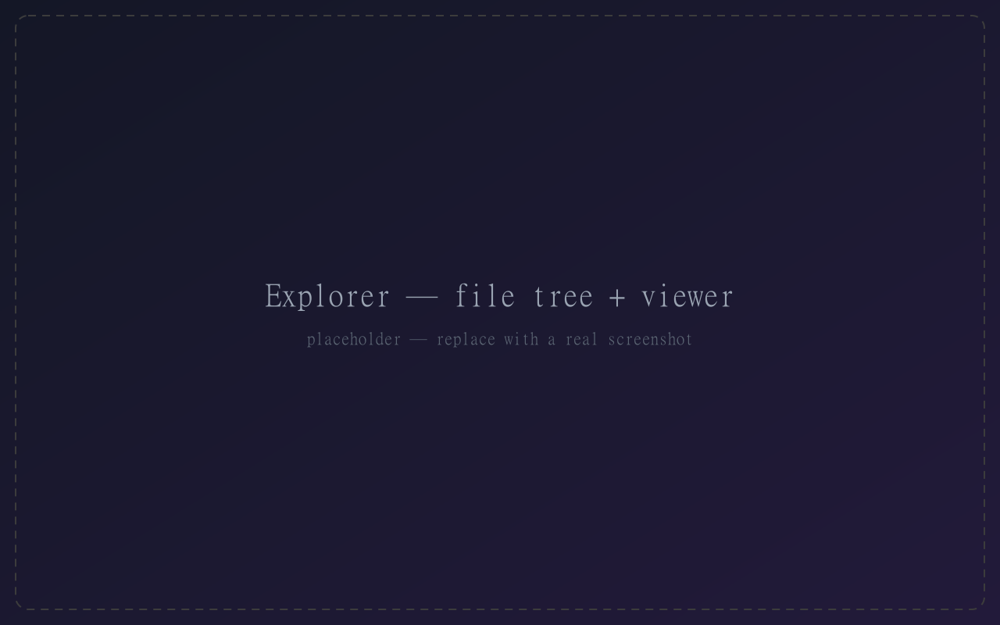
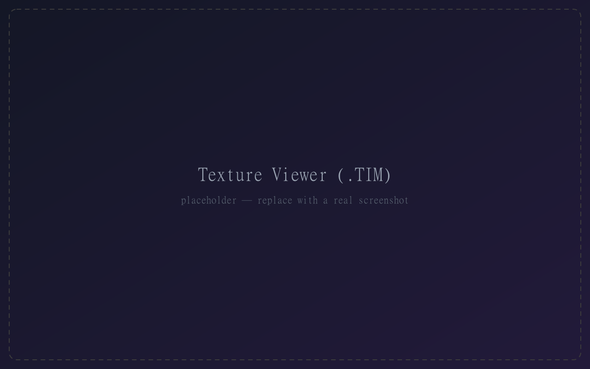
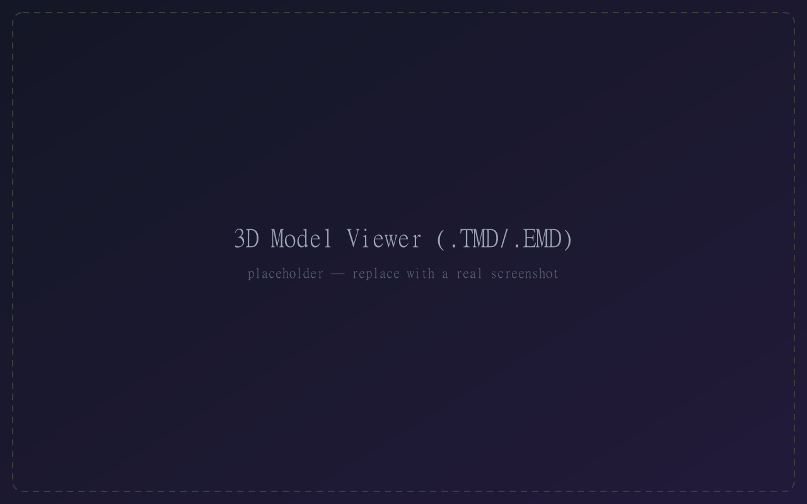
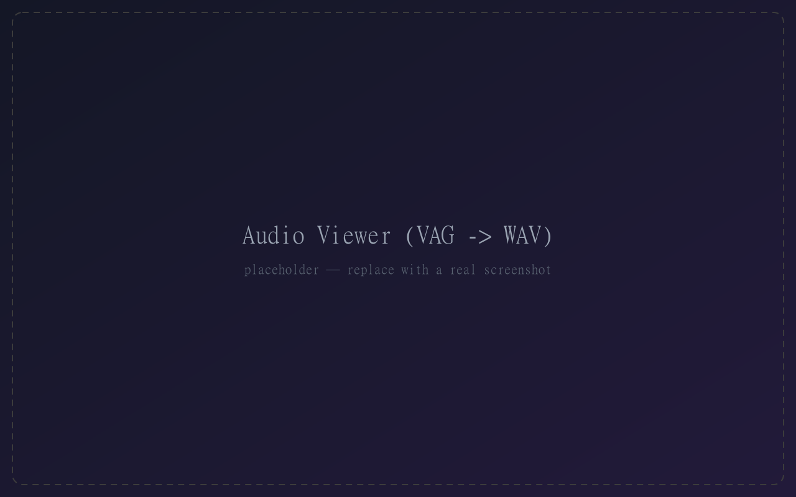
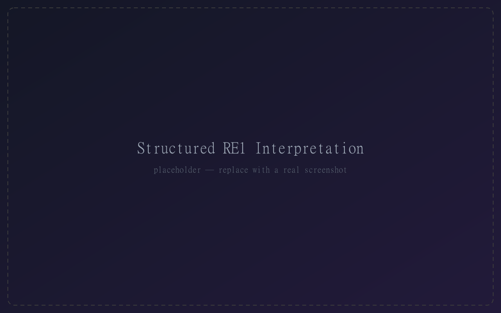

# User Guide

A walkthrough of Retro Archive Explorer, from opening a disc image to previewing each kind of asset.

> **Screenshots:** the images below are placeholders. See [Capturing screenshots](#capturing-screenshots) at the end to replace them with real ones.

## 1. The home screen

When the app launches with nothing open, you land on the **home screen**. It shows:

- an **Open image** button, and
- a list of **recent files** you can click to reopen instantly (no file dialog).

Each recent entry shows the file name, its full path, and when you last opened it. Use the **✕** on a row to forget a single file, or **Clear all** to empty the list.

## 2. Opening a disc image

Click **Open image** and choose an `.iso` or `.bin` disc image. The app mounts it and switches to the explorer. The file is added to your recent list automatically.

## 3. The explorer

The explorer has two panes:

- **Sidebar** — the disc's file tree. Expand folders to browse. Container files (`.RDT`, `.DAT`) are expandable too: opening one unpacks its sub‑files in place.
- **Viewer** — previews the selected file.

Use the **Home** button in the toolbar to return to the home screen at any time, or **Open image** to switch discs.

## 4. The viewer tabs

Every file opens on the **Preview** tab — its best interpretation — with **Hex** and **Text** always available:

| Tab | Shows |
| --- | --- |
| **Preview** | The interpreted asset (image, 3D model, audio player, structured data…) |
| **Hex** | An offset / hex / ASCII dump of the raw bytes |
| **Text** | The raw bytes decoded as text |

### Textures (`.TIM`)

Rendered to a canvas at native resolution over a checkerboard so transparency is visible.

### Models (`.TMD`, `.EMD`, `.IVM`)

Shown in a 3D viewport — drag to orbit, scroll to zoom. Models render with their vertex colors, or with a texture when one can be resolved.

### Audio (`.VAG` / SPU‑ADPCM)

Decoded to playable audio with a waveform. Formats that can't be decoded yet (streamed XA, VAB banks) are identified with a note instead.

### RE1 engine files (`.RDT`, `.DAT`, `.STF`, `camera.bin`, …)

Interpreted into a structured view — named sections, camera records, decoded text — so you can see what a file *is*. RDT rooms expand into their sections (background texture, sound, collision, …), each previewable on its own.

---

## Capturing screenshots

To replace the placeholders:

1. Run the app: `pnpm dev`.
2. Open a disc image and navigate to each view above.
3. Capture the window (Windows: `Win`+`Shift`+`S`; macOS: `Cmd`+`Shift`+`4`).
4. Save PNGs into `docs/img/` using the file names referenced above (`home.png`, `explorer.png`, `texture.png`, `model.png`, `audio.png`, `structured.png`).

The Markdown already points at those paths, so the guide fills in as you add them.
